# Table of Contents

[Python](#Python)  
* [Algorithms](#python-algorithms)
  - [Reverse an Array](#reverse-an-array-(python))  
  - [Shift an Array](#shift-an-array-(python)) 
  - [Array Binary Search](#array-binary-search-(python)) 
  - [Sum Matrix](#sum_matrix)
  - [Left Join](#left_join)
  - [Hashtable](#hashtable)

[JavaScript](#JavaScript)  
* [Algorithms](#javascript-algorithms)
  - [Reverse an Array](#reverse-an-array)  
  - [Shift an Array](#shift-an-array) 
  - [Array Binary Search](#array-binary-search) 
  - [FIFO Animal Shelter](#fifo-animal-shelter) 
  - [FizzBuzz Tree](#fizzbuzz-tree) 
  - [Selection Sort](#selection-sort) 
  - [Merge Sort](#merge-sort) 
  - [Quick Sort](#quick-sort) 
  - [Repeated Words](#repeated-words) 
  - [Tree Intersection](#tree-intersection) 

* [Data Structures](#data-structures)
  - [Linked Lists](#linked-lists) 
  - [Linked Lists Insertion](#linked-lists-(insertion)) 
  - [Linked Lists kth](#linked-lists-kth) 
  - [Linked Lists Merge Lists](#linked-lists-merge-lists) 
  - [Stack and Queue Implementation](#stack-and-queue-implementation) 
  - [Queue with Stacks](#queue-with-stacks)
  - [Breadth First](#breadth-first)
  - [Maximum Binary Tree](#maximum-binary-tree)
  - [Graph](#graph)
  - [Graph Breadth First](#graph-breadth-first)
  - [Get Edge](#get-edge)
  - [Graph Depth First](#graph-depth-first)

# Python
## Python Algorithms
## [Reverse an Array (Python)](https://github.com/eugenemonnier/data-structures-and-algorithms/pull/47)
Is it worth it? Let me work it.  
I put my arr down, flip it and reverse it.  
Ti esrever dna ti pilf, nwod rra ym tup i. 
\- Missy Elliot

### Challenge
Write a function called `__reverseArray__` which takes an array as an argument. Without utilizing any of the built-in methods available to your language, return an array with elements in reversed order.

### Approach & Efficency
I used a for loop to iterate through the inputed array. Then, in a new array, I added the original array's value at the array's length minus the current index minus one. This method allows arrays of any length to be reversed.

### Solution
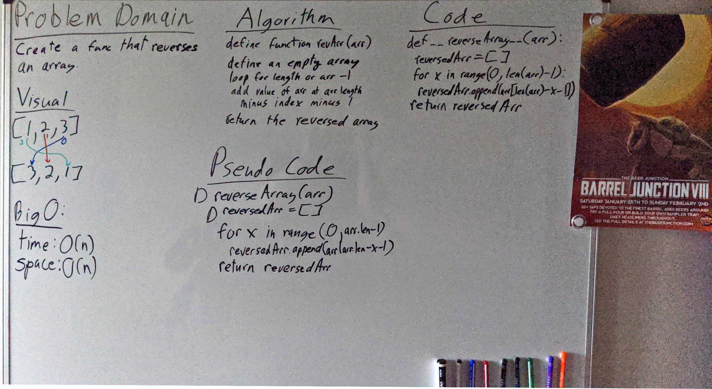

## [Shift an Array (Python)](https://github.com/eugenemonnier/data-structures-and-algorithms/pull/48)
Creating a function to insert a value into the middle of an array.

### Challenge
Write a function called `insert_shift_array()` which takes in an array and the value to be added. Without utilizing any of the built-in methods available to your language, return an array with the new value added at the middle index.

### Approach & Efficency
I started with finding the middle index of the given array. From there I first check to see if the array is empty, and if so just push the given value into the array. Otherwise I call a function that will iterate through the array, checking if the current index value isn't equal to the middle index value I defined previously. If that is true, I push the current element into a new array. Otherwise, I first push the given value into the new array and then push the current element.

This allows for arrays of any length, including zero, to return valid results. The entire solution takes about 11 lines of code.

### Solution
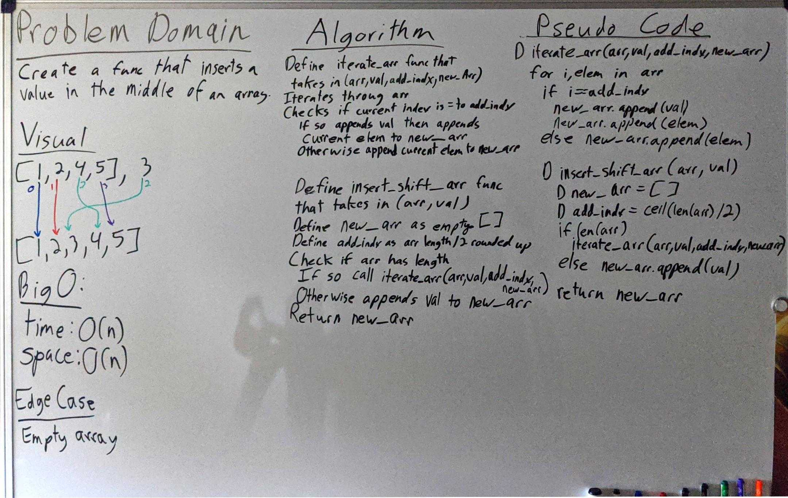

## [Array Binary Search (Python)](https://github.com/eugenemonnier/data-structures-and-algorithms/pull/49)
Creating a function to find the index of an array where the array's element is equal to the given value. If no element in the array matches, the function returns -1.

### Challenge
Write a function called BinarySearch which takes in 2 parameters: a sorted array and the search key. Without utilizing any of the built-in methods available to your language, return the index of the array’s element that is equal to the search key, or -1 if the element does not exist.

### Approach & Efficency
First, I create our recursive function that will do the actual searching for the element in the array. It starts off by setting the value of `index` equal to `ll` plus `hl` divided by 2 rounded down. Then we will check to see if `arr` at `index` is equal to our search `key`. If it is we will return the value of `index`. Otherwsie, if `ll` is greater than `hl` then the element does not exist in `arr` and we will return `-1`. Otherwise, we will check if the element of `arr` at `index` is less than `key`, and if so will recursively call `mid_point` but will replace the arg for `ll` with `index + 1`. Otherwise, we will recursively call `mid_point` but will replace the arg for `hl` with `index - 1`.

Then I'll create our `binary_search` function. It will first check to see if an empty array was given for the argument, `arr`. If it was, then we will return out of the function with `-1`. We will define variables `index` and `ll` with a value of 0 and `hl` with a value of the length of `arr` minus one. Then it will return the value of the recursive function `mid_point()`.

This function has a space complexity of `O(1)` and time compexity of `0(n)`. This function will work with arrays of any length, including empty arrays.

### Solution
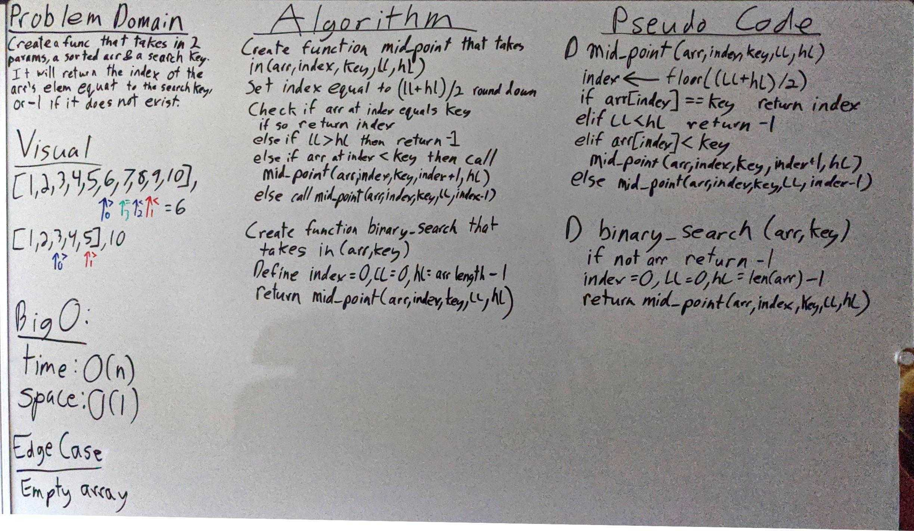

## [Sum Matrix](https://github.com/eugenemonnier/data-structures-and-algorithms/pull/51)

### Challenge
Creating a function to add up each row of a 2D matrix

### Approach & Efficency
Create a function that takes in a matrix. Then create an empty list called `result`. Enumerate through the input `matrix`. Append to `result` 0. Loop through inner list, adding to `result` at `matrix` index the current value of the list.

Space complexity is O(n). Time complexity is O(n2).

### Solution
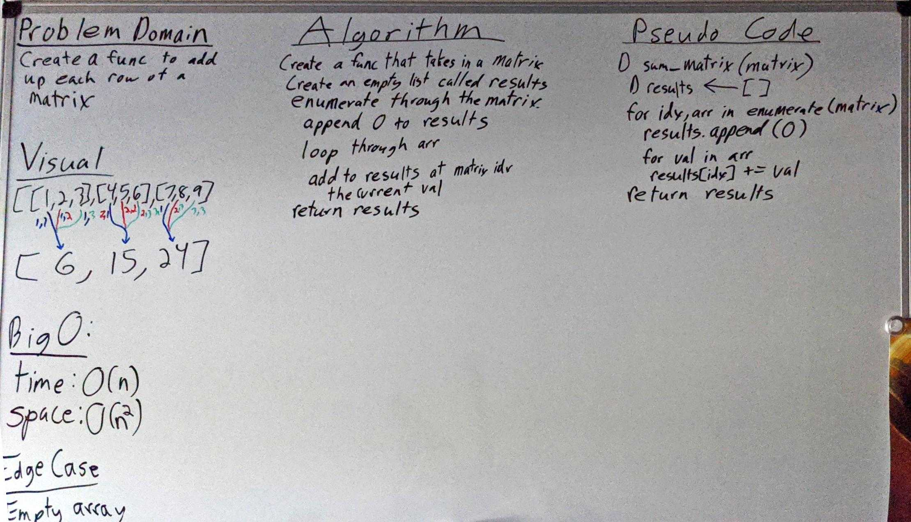

## [FIFO Animal Shelter](https://github.com/eugenemonnier/data-structures-and-algorithms/pull/57)
Create `AnimalShelter` class with methods `enqueue(animal)` and `dequeue(pref)`

### Challenge
- Create a class called `AnimalShelter` which holds only dogs and cats. The shelter operates using a first-in, first-out approach.
- Implement the following methods:
  - `enqueue(animal)`: adds `animal` to the shelter. `animal` can be either a `dog` or a `cat` object.
  - `dequeue(pref)`: returns either a dog or a cat. If `pref` is not `"dog"` or `"cat"` then return `null`.

### Solution & Efficency
I created the `AnimalShelter` class and the `enqueue` & `dequeue` methods.

With the `enqueue(animal)` method, I check to see if the `animal` provided is either `dog` or `cat`. If it is, the function pushes the `animal` object to the `shelter` array. Otherwise it returns an error message.

With the `dequeue(pref)` method, I check to see if `pref` is either a `dog` or `cat`. If so the function `removes` the first element in the list where the element's value is equal to `pref`. If the user did not give an arg for `pref` then `pref` is set to the `shelter.pop(0)` and the element at index 0 is removed. If the user enters in any other arg for `pref`, then `pref` is set to `None`. At the end of the function `pref` is returned.

### Solution
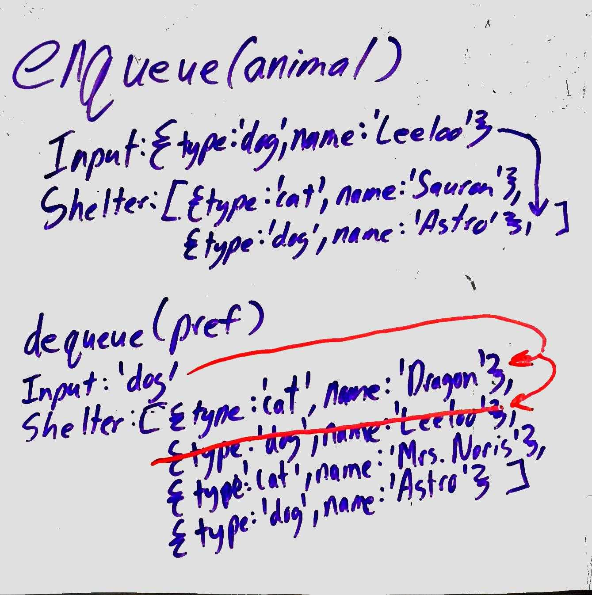

## [Multi-Bracket Validation](https://github.com/eugenemonnier/data-structures-and-algorithms/pull/58)

### Challenge
Your function should take a string as its only argument, and should return a boolean representing whether or not the brackets in the string are balanced. There are 3 types of brackets:

- Round Brackets : ()
- Square Brackets : []
- Curly Brackets : {}

## [Breadth Fist](https://github.com/eugenemonnier/data-structures-and-algorithms/pull/61)
  Added `breadth_first` method to `BinaryTree` class.

  ### Challenge
  - Write a breadth first traversal method which takes a Binary Tree as its unique input. Without utilizing any of the built-in methods available to your language, traverse the input tree using a breadth-first approach, and return a list of the values in the tree in the order they were encountered.

  ### Approach & Efficency
  For the breadth first traversal approach, we are going to use a queue data structure. Starting off, we define two empty arrays, `output` and `queue`. Next we'll check if the tree's `root` is not `null`. If it isn't `None`, `self.root` will be pushed to `queue`. Then we will traverse through the tree while the `queue.length` is greater than 0. In that look we create the variable `current` and set it to the node at `queue[0]`. Then we'll check to see if current node has a left branch. If it does, `current.left` will be pushed to `queue`. We will also check to see if the current node has a right branch. If it does, `current.right` will be pushed to `queue`. Before we remove the first node from the `queue` the value of that node is pushed to the `output` array. Finally `output` is returned from the function.

  ## [Maximum Binary Tree](https://github.com/eugenemonnier/data-structures-and-algorithms/pull/35)
  Added `maximum_binary` method to `BinaryTree` class.

  ### Challenge
  - Write an instance method called `maximumBinary`. Without utilizing any of the built-in methods available to your language, return the maximum value stored in the tree. You can assume that the values stored in the Binary Tree will be numeric.

  ### Approach & Efficency
  For the `maximum_binary` method, we create the variable `max_val` and set it to `-Infinity`. Then we traverse the tree checking if the current `node.value` is greater than `max_val`. If so, `max_val` is set to `node.value`. Finally the method will return `max_val`.

## [Repeated Words](https://github.com/eugenemonnier/data-structures-and-algorithms/pull/66)

### Challenge
Write a function that accepts a lengthy string parameter.

### Approach & Efficency
To start off this function, we create 4 new variables. `mod_str` that is set to the value of the input string, lowercased and with all punctuation removed. This is done so we don't modify the input. `word_dict` a new hashmap. `matched_word` set to a string value of 'No Match!'. This variable will store the value of the first repeated word. If there are no repeated words it will return the string 'No Match!' as the output of our function. Lastly, `word_arr`, which is set to the value of `mod_str` that splits the string up by spaces, creating an array of individual words. Now we go into a `for` loop that will iterate over the `word_arr`. In that loop we will check to see if the `word_dict` has a key that is the same as the current word in `word_arr`. If that is the case `matched_word` will be set to the value of the current word in the `word_arr` array. Then it will break out of the loop. Otherwise it will set the key value pair of `word_dict` to the current word in the `word_arr` array. Finally, outside the loop we return `matched_word`.

### Visual
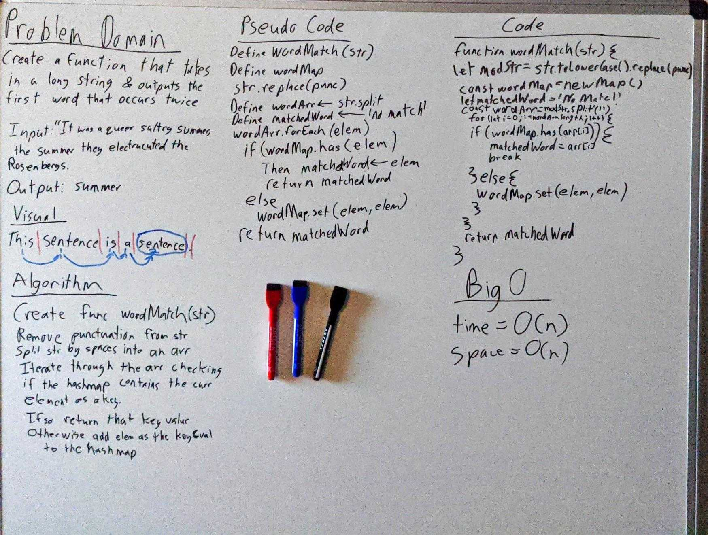

### [Tree Intersection](https://github.com/eugenemonnier/data-structures-and-algorithms/pull/67)

### Challenge
- Write a function called `tree_intersection` that takes two binary tree parameters.
- Without utilizing any of the built-in library methods available to your language, return a set of values found in both trees.

### Approach & Efficency
After defining the function `tree_intersection` which takes in two trees `(tree_a, tree_b)`. Then we define an array called `tree_arr` and set its value to the output of `tree_a.pre_order()`. Next, we define another array called `output_arr` and set its value to the output of `tree_b.match_tree(tree_arr)`.

From there we will go into our new method `match_tree(arr)` which is a part of the `BinaryTree` class. In that method we'll define an array called `output`. Then we will define another function called `match_traverse(node, arr)` which takes in a node and an array. It will first check to see if the `node` is empty and if so will exit the function. Then it will check if our `tree_arr` array contains the current value of `node.value`. If it does it will push that value to our `output` array. Then it'll check if `node.left` exists and if so will call `match_traverse(node.left, arr)`. Then do the same for `node.right`  calling `match_traverse(node.right, arr)` if it exists. Outside of that function we call `match_traverse` on `this.root` & `arr` to start traversing the tree. Returning the `output` from `match_tree`, which is what `output_arr` gets set to.

Back in the function `tree_intersection`, we will check to see if `output_arr` contains any values. If it does not then the string `'No match found.'` will get pushed to `output_arr`. Finally we get our result by returning `output_arr`.

### Visual
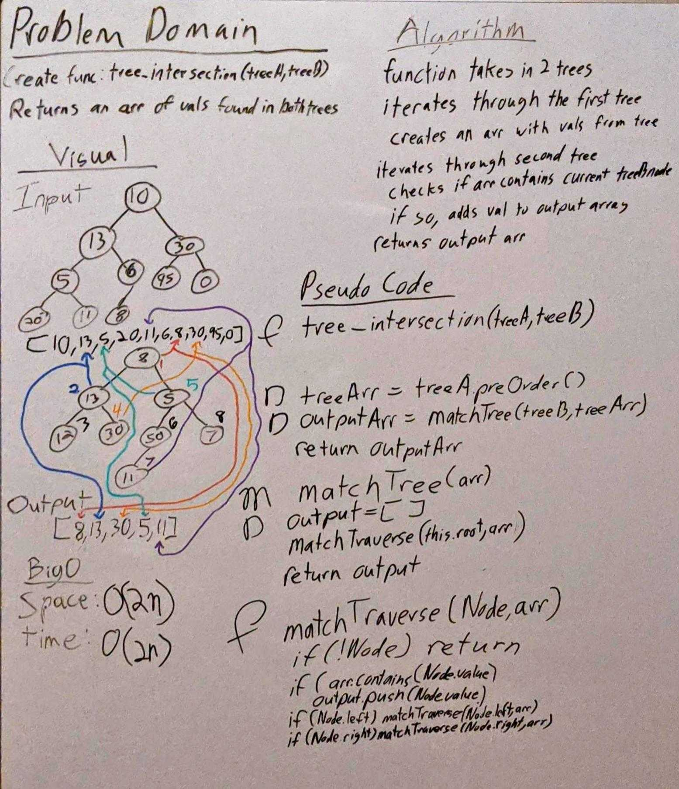

### [Left Join](https://github.com/eugenemonnier/data-structures-and-algorithms/pull/68)

### Challenge
- Write a function that LEFT JOINs two hashmaps into a single data structure.
- The first parameter is a hashmap that has word strings as keys, and a synonym of the key as values.
- The second parameter is a hashmap that has word strings as keys, and antonyms of the key as values.
- Combine the key and corresponding values (if they exist) into a new data structure according to LEFT JOIN logic.
- LEFT JOIN means all the values in the first hashmap are returned, and if values exist in the “right” hashmap, they are appended to the result row. If no values exist in the right hashmap, then some flavor of `None` should be appended to the result row.
- The returned data structure that holds the results is up to you. It doesn’t need to exactly match the output below, so long as it achieves the LEFT JOIN logic.
- Avoid utilizing any of the library methods available to your language.

### Approach & Efficency
Our function `left_join` will have two parameters, `left_map` and `right_map`. For this function we will start off with creating an empty list, called `output`. Then we will loop through all the keys in `left_map`. Inside the loop we will define a new list, called `temp`, and give it two values, the current `key` and the value of `left_map` at the current `key`. Next we will check if the `right_map` contains the current `key`, and if it does, append the value of `right_map` at the current `key` to `temp`. Otherwise we will append `None` to `temp`. Next we will append `temp` to `output. Finally, outside the loop, we will return `output`.

This solution will have a time complexity of `O(n)` as the function will only loop through all the keys in `left_map` once. Looking up a key in a hashmap and appending to a list have time complexities of `O(1)`. The space complexity is also `O(n)` as the size of our new data structure will never be longer than the size of our input.

### Visual
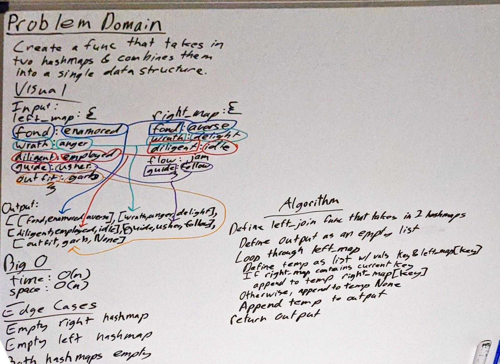

## [Get Edge](https://github.com/eugenemonnier/data-structures-and-algorithms/pull/71)

### Challenge
- Write a function based on the specifications above, which takes in a graph, and an array of city names. Without utilizing any of the built-in methods available to your language, return whether the full trip is possible with direct flights, and how much it would cost.

### Approach & Efficency
The `get_edges` method takes in `node_a` and `node_b` as parameters. First it will get the adjacency map from `node_a` and store that in `neighbor_list`. Next it will loop through the `neighbor_list` checking if the current `neightbor['node']` value is equal to the second input, `node_b`. If it is, the method will immediately return a string, indicating the edge was found and its `weight`. If the loop concludes without finding a match, the function will return a sting of `'false, 0'`.

This method has a time complexity of `O(n)` as it will only loop through the `neighbor_list` once and the `get` method has a time complexity of `O(1)`. The space complexity of this method is also `O(n)` as it creates a list data structre which will have a length equal to the length of `node_a`'s adjacency list.

### Visual
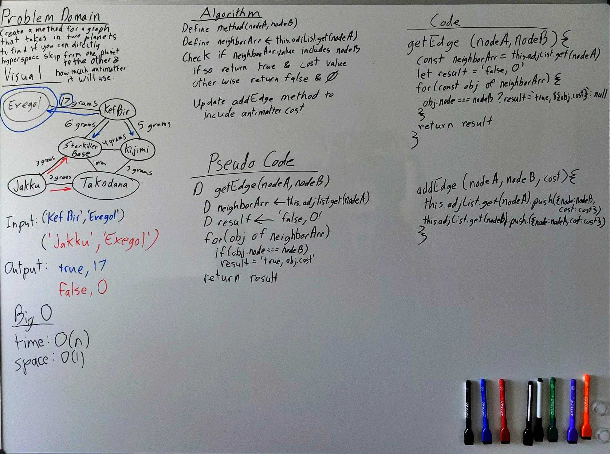

## [Graph Depth First](https://github.com/eugenemonnier/data-structures-and-algorithms/pull/72)

### Challenge
- Create a function that accepts an adjacency list as a graph, and conducts a depth first traversal.

### Approach & Efficency
The `depth_first` method takes in `root` as the parameter. First it will check if the graph's `node_list` contains any elements. If it does not the method will return a string of `'Graph does not contain any nodes.'` Otherwise the method will continue and create a `visited` dictionary and a `results` list. Looping through the graph's `node_list` it will build the `visited` dictionary with a key of the current `node` and a value of `false`. Next the method will check to see if the given `root` node is contained in the `visited` dictionary. If it is not it will return a string of `'Node does not exist in graph.'` Otherwise the method will continue and call the `DFT` method with arguments of `root`, `visited`, and `results. Finally the `depth_first` method will return the `results` list.

The `DFT` method takes in `node`, `visited`, and `results` as parameters. It will first check if the key of `node` in the dictionary `visited` does not have a value of `True`. If so it will set the value for the key of `node` in the `visited` dictionary to True and append `node` to the `results` list. Then it will retrieve the edges for that node and store them in the `neighbors` list. Looping through that list, the method will recursively call itself with arguments of `neightbor['node']`, visited, and results. Otherwise if the key of `node` in the dictionary `visited` does have a value of `True`, it will return the `results` list.

This method will have a time complexity of `O(n)` as it will traverse the entirety of the graph, visiting each node only once. The space complexity will also be `O(n)` as the method creates 2 data structures that will have lengths up to the length of the input.

### Visual
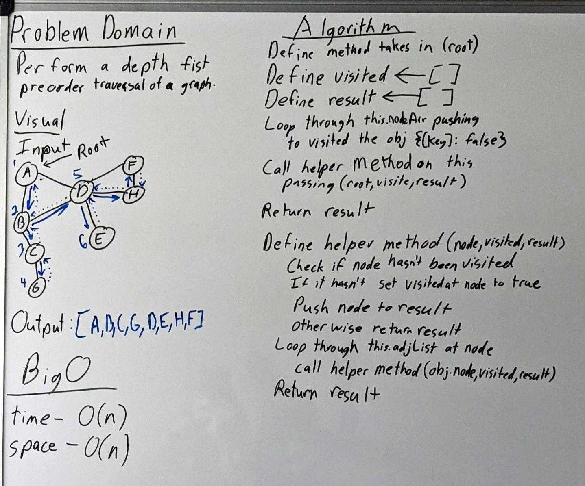

# Data Structures
## [Linked Lists](https://github.com/eugenemonnier/data-structures-and-algorithms/pull/52)
Create `LinkedList` and `Node` classes. `LinkedList` class contains methods `insert()` (inserts node at head), `includes()` (finds if linked list contains given value), and `toString()` (converts a linked list into a string value).

### Challenge
- Create a Node class that has properties for the value stored in the Node, and a pointer to the next Node.
- Within your LinkedList class, include a head property. Upon instantiation, an empty Linked List should be created.
  - Define a method called insert which takes any value as an argument and adds a new node with that value to the head of the list with an O(1) Time performance.
  - Define a method called includes which takes any value as an argument and returns a boolean result depending on whether that value exists as a Node’s value somewhere within the list.
  - Define a method called toString (or __str__ in Python) which takes in no arguments and returns a string representing all the values in the Linked List, formatted as:
"{ a } -> { b } -> { c } -> NULL"
- Any exceptions or errors that come from your code should be semantic, capturable errors. For example, rather than a default error thrown by your language, your code should raise/throw a custom, semantic error that describes what went wrong in calling the methods you wrote for this lab.
- Be sure to follow your language/frameworks standard naming conventions (e.g. C# uses PascalCasing for all method and class names).

### Approach & Efficency
After creating the `Node` & `LinkedList` classes, I created three methods: `insert()`, `includes()`, `toString()`.

The `insert()` method creates a variable, `new_node` that calls a new instance of the `Node` constructor passing in the give value.  Then the .next key value is changed from null to the value of the linked list's head, so that the new node points to the linked list's head. Then the linked list's head is given the value of `new_node` adding the new node at the beginning of the list. This method only needs to access the head of the linked list giving it a O(1) time performance.

The `includes()` method starts by creating the variable `result` and setting its value to `false`. Then the function checks to see if the linked list is empty. If it is and the given value was `null` then the function returns `true`. If the given value was any other value, an empty linked list returns `false`. Otherwise the variable `current_node` is created and its value is set to the head of the linked list. Then while the value of `current_node.next` does not equal `null` the function traverses the linked list breaking out of the loop and returning `true` if either the `current_node.next.value`, the `current_node.value`, or the `current_node.next.next` is equal to the given value. Otherwise the function returns `false`.

The `__str__()` method starts by creating an empty string variable, `linked_string`, and a variable `current_node` that is given the value of the linked list's head. If the linked list is empty the function will return a string value of `'NULL'`. Otherwise the function will traverse the linked list adding the `current_node.value` to the `linked_string` variable. If `current_node.next.next` is equal to `null` then the `current_node.next.value` will also be added to the `linked_string` variable. After which the function will return the value of the varaible `linked_string`.

## [Linked Lists (Insertion)](https://github.com/eugenemonnier/data-structures-and-algorithms/pull/52)
Create three additonal methods for the LinkedList class.

### Challenge
- `.append(value)` which adds a new node with the given `value` to the end of the list
- `.insert_before(value, new_val)` which add a new node with the given `new_val` immediately before the first value node
- `.insertAfter(value, new_val)` which add a new node with the given `new_val` immediately after the first `value` node

### Approach & Efficency
- `.append(val)` traverses the linked list, till it reaches the end. Then it adds a new node with the given `val` at the end of the list. Time = O(n), Space 0(n).

- `.insert_before(value, new_val)` traverses the linked list checking if the value of the next node is equal to the given `value`. When it finds that value it sets the current node to point to the new node and the new node to point to the next node. Time = O(n), Space 0(n).

- `.insertAfter(value, new_val)` traverses the linked list checking if the value of the next node is equal to the given `value`. When it finds that value it sets the next node to point to the new node and the new node to point to the next next node. Time = O(n), Space 0(n).

### Solution
.jpg).jpg)

## [Linked Lists kth](https://github.com/eugenemonnier/data-structures-and-algorithms/pull/53)
Create a new method, kth().

### Challenge
- Write a method for the Linked List class which takes a number, `k`, as a parameter. Return the node’s value that is `k` from the end of the linked list.

### Approach & Efficency
- `.kth(k)` traverses the linked list, till it reaches the end. While it does that it pushes the value of the current node into an list. If the list's length is longer than `k` it will `pop()` off the first element in the list. Once it reaches the end of the list, the method returns the value of the list at index 0. Time = O(n), Space 0(n).

## [Linked Lists Merge Lists](https://github.com/eugenemonnier/data-structures-and-algorithms/pull/54)
Create a new function, mergeLists();

### Challenge
- Write a function called `merge_lists` which takes two linked lists as arguments. Zip the two linked lists together into one so that the nodes alternate between the two lists and return a reference to the head of the zipped list.

### Approach & Efficency
- `merge_lists()` takes in two lists and traverses both lists simultaneously. First `list_a` is checked to see if it's current value isn't `None` and if not, that value is added to the `merged_ll` through the `.append()` method. Next the same is done with `listB`. This will continue untill the value of boths lists equal `None`. Finally `merged_ll` is returned.

## [Stack and Queue Implementation](https://github.com/eugenemonnier/data-structures-and-algorithms/pull/55)
Created a Stack class (first in last out) and a Queue class (first in first out)

### Challenge
- Create a `Node` class that has properties for the value stored in the Node, and a pointer to the next node.
- Create a `Stack` class that has a `top` property. It creates an empty Stack when instantiated.
  - This object should be aware of a default empty value assigned to `top` when the stack is created.
  - Define a method called `push` which takes any value as an argument and adds a new node with that value to the `top` of the stack with an O(1) Time performance.
  - Define a method called `pop` that does not take any argument, removes the node from the `top` of the stack, and returns the node’s value.
  - Define a method called `peek` that does not take an argument and returns the value of the node located on `top` of the stack, without removing it from the stack.
  - Define a method called `isEmpty` that does not take an argument, and returns a boolean indicating whether or not the stack is empty.
- Create a `Queue` class that has a `front` property. It creates an empty Queue when instantiated.
  - This object should be aware of a default empty value assigned to `front` when the queue is created.
  - Define a method called `enqueue` which takes any value as an argument and adds a new node with that value to the back of the queue with an O(n) Time performance.
  - Define a method called `dequeue` that does not take any argument, removes the node from the `front` of the queue, and returns the node’s value.
  - Define a method called `peek` that does not take an argument and returns the value of the node located in the `front` of the queue, without removing it from the queue.
  - Define a method called `isEmpty` that does not take an argument, and returns a boolean indicating whether or not the queue is empty.

### Approach & Efficency
For the `Stack` class, I created the methods `push`, `pop`, `peek`, and `isEmpty`.
  - For the `push` method, I create a new variable, `new_node`, which is an instance of `Node` with the given `value` as the argument. The `next` property of that value is given the value of the stack's `top` property. Then the stack's `top` property is set to `new_node`.
  - For the `pop` method, I first check to see if the stack is empty. If it is, the the method returns `None`. Otherwise, I check if the stack has only one node on the stack by checking whether the value of the stack's `next` value exists. If it does not then we set the value of the stack's `top` to `null` and return it. Otherwise we set the stack's `top.value` to the `next.value`, then set the stack's `top.next` to the value of `top.next.next`, returning the stack's `top.value`.
  - For the `peek` method, I just return the `top.value` of the stack.
  - For the `isEmpty` method, I check if `top` of the stack exists. If so, the method returns `false`, otherwise it returns `true`.

For the `Queue` class, I created the methods `enqueue`, `dequeue`, `peek`, and `isEmpty`.
  - For the `enqueue` method, I create a new variable, `new_node`, which is an instance of `Node` with the given `value` as the argument. Then I check if the `front` of the queue exists. If it does not, I set the `front` to `new_node`. Otherwise, I create the variable `curr_node` which is set to the queues `front`. From there I traverse the queue until I reach the end of the queue. At that point `curr_node.next` is set to equal `new_node`. Returning the `front` of the queue.
  - For the `dequeue` method, I create a new variable, `dequeue_value`. Then I check if the `front` of the queue exists. If it does not, then the function returns `None`. Otherwise I check to see if the queue's `front.next` exists. If it doesn't, then `dequeue_value` is set to the queue's `front.value`, the queue's `front` is set to `null`, and the function returns `dequeue_value`. Otherwise, `dequeue_value` is set to the queue's `front.value`, the queue's `front.value` is set to `front.next.value`, the queue's `front.next` is set to `front.next.next`, and the function returns the value of `dequeue_value`.
  - For the `peek` method, I just return the `front.value` of the stack.
  - For the `isEmpty` method, I check if `front` of the stack exists. If so, the method returns `false`, otherwise it returns `true`.

## [Queue with Stacks](https://github.com/eugenemonnier/data-structures-and-algorithms/pull/56)
Created PseudoQueue class and methods

### Challenge
- Create a brand new `PseudoQueue` class. Do not use an existing `Queue`. Instead, this `PseudoQueue` class will implement our standard queue interface (the two methods listed below), but will internally only utilize 2 `Stack` objects. Ensure that you create your class with the following methods:

  - `enqueue(value)` which inserts value into the `PseudoQueue`, using a first-in, first-out approach.
  - `dequeue()` which extracts a value from the `PseudoQueue`, using a first-in, first-out approach.
- The `Stack` instances have only `push`, `pop`, and `peek` methods. You should use your own `Stack` implementation. Instantiate these `Stack` objects in your `PseudoQueue` constructor.

###  Approach & Efficency
- For the `PseudoQueue` class, I created the methods `enqueue` and `dequeue`.
  - For the `enqueue` method, I created the variables `first_stack` & `second_stack` as instances of `PseudoQueue`. If the `PseudoQueue` is empty, `push` the `value` to `second_stack`. Otherwise create the variable `currNode` and set to the `PseudoQueue`'s `top`. Then traverse the `PseudoQueue`, `push`ing to the `first_stack` the `currNode.value`. Once reaching the end, `push`ing the given `value`. After which, going to traverse through `first_stack` and push each `value` to the `second_stack`. Finally setting `self.top` to `second_stack.top` and returning `self.top`.

## [Graph](https://github.com/eugenemonnier/data-structures-and-algorithms/pull/69)

### Challenge
- Implement your own Graph. The graph should be represented as an adjacency list, and should include the following methods:

- AddNode()
  - Adds a new node to the graph
  - Takes in the value of that node
  - Returns the added node
- AddEdge()
  - Adds a new edge between two nodes in the graph
  - Include the ability to have a “weight”
  - Takes in the two nodes to be connected by the edge
  - Both nodes should already be in the Graph
- GetNodes()
  - Returns all of the nodes in the graph as a collection (set, list, or similar)
- GetNeighbors()
  - Returns a collection of edges connected to the given node
  - Takes in a given node
  - Include the weight of the connection in the returned collection
- Size()
  - Returns the total number of nodes in the graph

### Visual
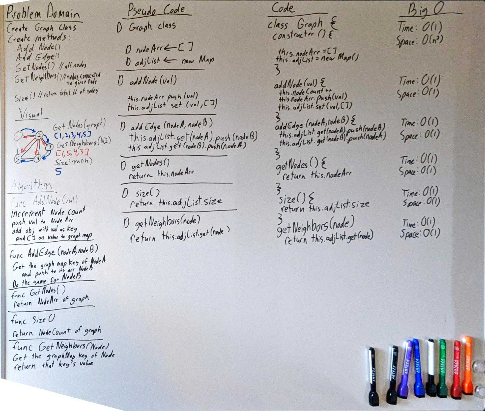

## [Graph Breadth First](https://github.com/eugenemonnier/data-structures-and-algorithms/pull/44)

# JavaScript
## JavaScript Algorithms
## [Reverse an Array](https://github.com/eugenemonnier/data-structures-and-algorithms/pull/20)
Is it worth it? Let me work it.  
I put my arr down, flip it and reverse it.  
Ti esrever dna ti pilf, nwod rra ym tup i. 
\- Missy Elliot

### Challenge
Write a function called `reverseArray()` which takes an array as an argument. Without utilizing any of the built-in methods available to your language, return an array with elements in reversed order.

### Approach & Efficency
I used the `forEach` method to iterate through the inputed array, passing through the current value and index. Then, in a new array, I set the current value's index to the original array's length minus the current index minus one. This method allows arrays of any length to be reversed.

Alternatively, I also fed the array through a for loop that sets the starting index at the array length minus 1. Each iteration of the loop the index value will be reduced by 1. In the loop, I push to a new array the value of the original array at the current index.

Both of these methods will console log the original array reversed. Both of these methods allows arrays of any length to be reversed using 6 lines of code.

### Solution
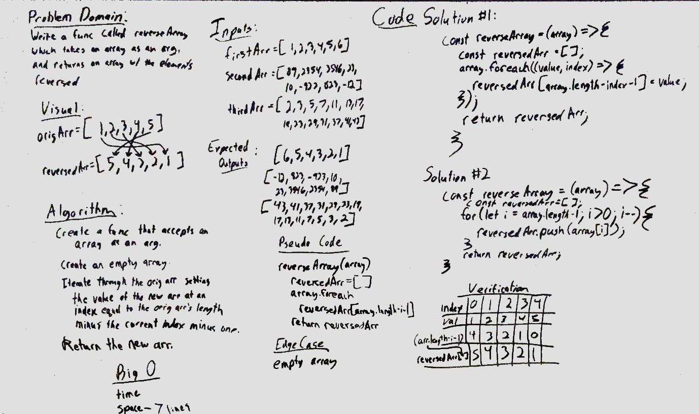

## [Shift an Array](https://github.com/eugenemonnier/data-structures-and-algorithms/pull/21)
Creating a function to insert a value into the middle of an array.

### Challenge
Write a function called `insertShiftArray()` which takes in an array and the value to be added. Without utilizing any of the built-in methods available to your language, return an array with the new value added at the middle index.

### Approach & Efficency
I started with finding the middle index of the given array. From there I first check to see if the array is empty, and if so just push the given value into the array. Otherwise I call a function that will iterate through the array, checking if the current index value isn't equal to the middle index value I defined previously. If that is true, I push the current element into a new array. Otherwise, I first push the given value into the new array and then push the current element.

This allows for arrays of any length, including zero, to return valid results. The entire solution takes about 11 lines of code.

### Solution
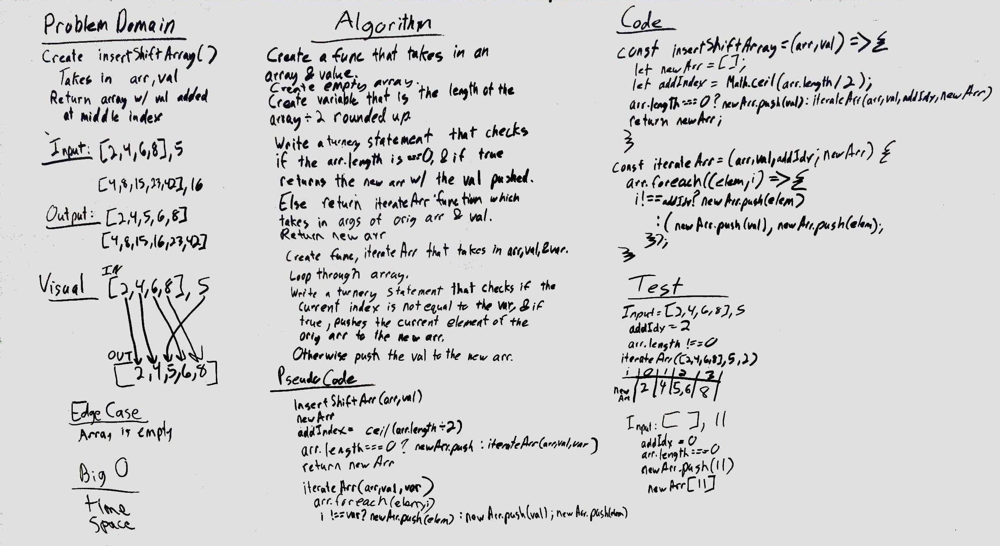

## [Array Binary Search](https://github.com/eugenemonnier/data-structures-and-algorithms/pull/23)
Creating a function to find the index of an array where the array's element is equal to the given value. If no element in the array matches, the function returns -1.

### Challenge
Write a function called BinarySearch which takes in 2 parameters: a sorted array and the search key. Without utilizing any of the built-in methods available to your language, return the index of the array’s element that is equal to the search key, or -1 if the element does not exist.

### Approach & Efficency
In the function I begin with setting the variable to be returned to equal -1. From there I loop through the array, evaluating on each iteration, if the current element of the array matches the given key value. If it does, the index variable is set to equal the current index value of the loop. If it doesn't, nothing happens. Finally the function returns the value of the index variable.

This function takes 6 lines of code. This function will work with arrays of any length, including empty arrays. It will also work if a ey value is not given.

### Solution
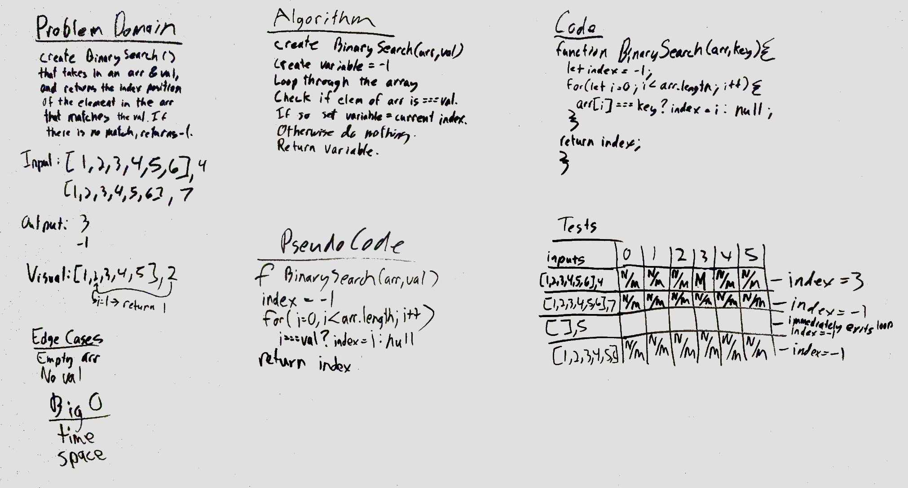

## [FIFO Animal Shelter](https://github.com/eugenemonnier/data-structures-and-algorithms/pull/31)
Create `AnimalShelter` class with methods `enqueue(animal)` and `dequeue(pref)`

### Challenge
- Create a class called `AnimalShelter` which holds only dogs and cats. The shelter operates using a first-in, first-out approach.
- Implement the following methods:
  - `enqueue(animal)`: adds `animal` to the shelter. `animal` can be either a `dog` or a `cat` object.
  - `dequeue(pref)`: returns either a dog or a cat. If `pref` is not `"dog"` or `"cat"` then return `null`.

### Solution & Efficency
I created the `AnimalShelter` class and the `enqueue` & `dequeue` methods.

With the `enqueue(animal)` method, I check to see if the `animal.type` provided is either `dog` or `cat`. If it is, the function pushes the `animal` object to the `shelter` array. Otherwise it returns an error message.

With the `dequeue(pref)` method, I check to see if `pref` is either a `dog` or `cat`. If so the function loops through the `shelter` array checking whether `shelter.type` is equal to `pref`. When it finds a match, it splices the `shelter` array at the index of the match. If the user did not give an arg for `pref` then `pref` is set to the `shelter[0].type` and the object at index 0 is removed. If the user enters in any other arg for `pref`, then `pref` is set to null. At the end of the function `pref` is returned.

### Solution

## [FizzBuzz Tree](https://github.com/eugenemonnier/data-structures-and-algorithms/pull/33)
Create `BinaryTree` and `Node` classes. `BinaryTree` class contains methods `preOrder()` and `insert()` methods. Also create a`fizzBuzzTree` function and a `traverse` function.

### Challenge
- Write a function called FizzBuzzTree which takes a tree as an argument.
- Without utilizing any of the built-in methods available to your language, determine whether or not the value of each node is divisible by 3, 5 or both. Create a new tree with the same structure as the original, but the values modified as follows:
  - If the value is divisible by 3, replace the value with “Fizz”
  - If the value is divisible by 5, replace the value with “Buzz”
  - If the value is divisible by 3 and 5, replace the value with “FizzBuzz”
- If the value is not divisible by 3 or 5, simply turn the number into a String.
- Return the new tree.

### Approach & Efficency
The `fizzBuzzTree(tree)` function takes in a binary tree and calls the `traverse` function passing in an argument of `tree.root`. Then the function returns `tree`.

The `traverse` function takes in a node. It checks if the node is `null`. If it is, then it returns `null`. Otherwise it first checks if `Node.value` is divisible by 15. If it is, then it will change `Node.value` to 'fizzbuzz'. Otherwise, it will next check to see if `Node.value` is divisible by 3. If it is, then it will change `Node.value` to 'fizz'. Otherwise, it will next check to see if `Node.value` is divisible by 5. If it is, then it will change `Node.value` to 'buzz'. Otherwise, it will change `Node.value` to a stringified version of the `Node.value`.  Then the function will recursively call `traverse` passing in `Node.left` and then again call `traverse` passing in `Node.right`.

## [Selection Sort](https://github.com/eugenemonnier/data-structures-and-algorithms/pull/38)
Create a `selectionSort` function.

### Challenge
Create a function called `selectionSort` that takes in an array of integers and returns that array sorted lowest to highest.

### Approach & Efficency
First we create the `selectionSort` function that takes in an array of integers. Then we create a variable, `n`, to use for the array length. Next we enter a for loop that continues for as long as `i` is less than `n - 1`. Inside that loop we create the variable `min` and set its value to `i`. Then we go inside an inner loop. In that loop we set `j` equal to `i + 1`, and continue for as long as `j` is less than `n`. Inside that loop we will check to see if our array at index `j` is less than our array at inder `min`. If it is then we set `min` equal to `j`. After we get out of the inner loop we create the variable `temp` and set its value equal to the array at index `min` which will be the lowest value found in the inner loop. From there the array at `min` is set to the array at `i` and the array at `i` is set to the value of `temp`. After we exit the outer loop we return the array which will now be sorted lowest to highest.

### Solution
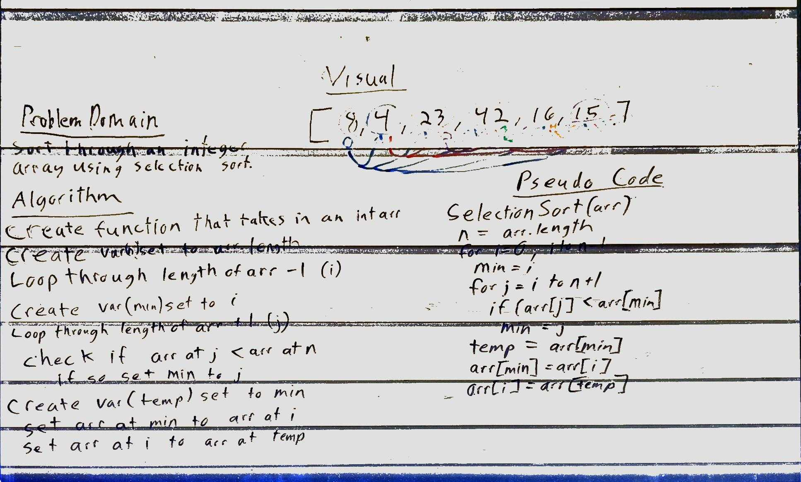

## [Merge Sort](https://github.com/eugenemonnier/data-structures-and-algorithms/pull/39)
Create a `mergeSort` function and test it.

### Challenge
Create a `mergeSort` function that takes in an array of integers and sorts them lowest to highest, using the Merge Sort algorithm.

### Approach & Efficency
See [blog](./code-challenges/mergeSort/blog.md) entry.

### Visual
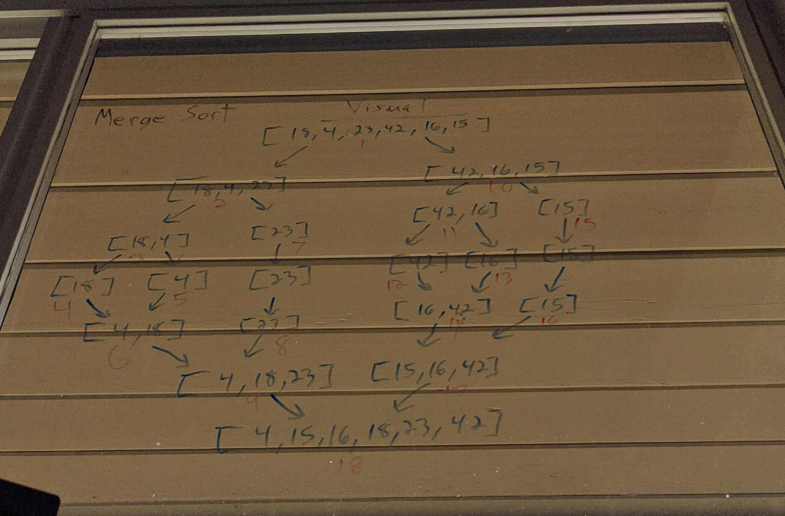

## [Quick Sort](https://github.com/eugenemonnier/data-structures-and-algorithms/pull/40)

### Challenge

### Approach & Efficency

## [Repeated Words](https://github.com/eugenemonnier/data-structures-and-algorithms/pull/41)

### Challenge
Write a function that accepts a lengthy string parameter.

### Approach & Efficency
To start off this function, we create 4 new variables. `modStr` that is set to the value of the input string, lowercased and with all punctuation removed. This is done so we don't modify the input. `wordMap` a new hashmap. `matchedWord` set to a string value of 'No Match!'. This variable will store the value of the first repeated word. If there are no repeated words it will return the string 'No Match!' as the output of our function. Lastly, `wordArr`, which is set to the value of `modStr` that splits the string up by spaces, creating an array of individual words. Now we go into a `for` loop that will iterate over the `wordArr`. In that loop we will check to see if the `wordMap` has a key that is the same as the current word in `wordArr`. If that is the case `matchedWord` will be set to the value of the current word in the `wordArr` array. Then it will break out of the loop. Otherwise it will set the key value pair of `wordMap` to the current word in the `wordArr` array. Finally, outside the loop we return `matchedWord`.

### Visual

### [Tree Intersection](https://github.com/eugenemonnier/data-structures-and-algorithms/pull/42)

### Challenge
- Write a function called `tree_intersection` that takes two binary tree parameters.
- Without utilizing any of the built-in library methods available to your language, return a set of values found in both trees.

### Approach & Efficency
After defining the function `treeIntersection` which takes in two trees `(treeA, treeB)`. Then we define an array called `treeArr` and set its value to the output of [`treeA.preOrder()`](./code-challenges/Data-Structures/tree/tree.js). Next, we define another array called `outputArr` and set its value to the output of `treeB.matchTree(treeArr)`.

From there we will go into our new method `matchTree(arr)` which is a part of the `BinaryTree` class. In that method we'll define an array called `output`. Then we will define another function called `matchTraverse(Node, arr)` which takes in a node and an array. It will first check to see if the `Node` is empty and if so will exit the function. Then it will check if our `treeArr` array contains the current value of `Node.value`. If it does it will push that value to our `output` array. Then it'll check if `Node.left` exists and if so will call `matchTraverse(Node.left, arr)`. Then do the same for `Node.right`  calling `matchTraverse(Node.right, arr)` if it exists. Outside of that function we call `matchTraverse` on `this.root` & `arr` to start traversing the tree. Returning the `output` from `matchTree`, which is what `outputArr` gets set to.

Back in the function `treeIntersection`, we will check to see if `outputArr` contains any values. If it does not then the string `'No match found.'` will get pushed to `outputArr`. Finally we get our result by returning `outputArr`.

### Visual

# Data Structures
## [Linked Lists](https://github.com/eugenemonnier/data-structures-and-algorithms/pull/25)
Create `LinkedList` and `Node` classes. `LinkedList` class contains methods `insert()` (inserts node at head), `includes()` (finds if linked list contains given value), and `toString()` (converts a linked list into a string value).

### Challenge
- Create a Node class that has properties for the value stored in the Node, and a pointer to the next Node.
- Within your LinkedList class, include a head property. Upon instantiation, an empty Linked List should be created.
  - Define a method called insert which takes any value as an argument and adds a new node with that value to the head of the list with an O(1) Time performance.
  - Define a method called includes which takes any value as an argument and returns a boolean result depending on whether that value exists as a Node’s value somewhere within the list.
  - Define a method called toString (or __str__ in Python) which takes in no arguments and returns a string representing all the values in the Linked List, formatted as:
"{ a } -> { b } -> { c } -> NULL"
- Any exceptions or errors that come from your code should be semantic, capturable errors. For example, rather than a default error thrown by your language, your code should raise/throw a custom, semantic error that describes what went wrong in calling the methods you wrote for this lab.
- Be sure to follow your language/frameworks standard naming conventions (e.g. C# uses PascalCasing for all method and class names).

### Approach & Efficency
After creating the `Node` & `LinkedList` classes, I created three methods: `insert()`, `includes()`, `toString()`.

The `insert()` method creates a variable, `createNode` that calls a new instance of the `Node` constructor passing in the give value.  Then the .next key value is changed from null to the value of the linked list's head, so that the new node points to the linked list's head. Then the linked list's head is given the value of `createNode` adding the new node at the beginning of the list. This method only needs to access the head of the linked list giving it a O(1) time performance.

The `includes()` method starts by creating the variable `result` and setting its value to `false`. Then the function checks to see if the linked list is empty. If it is and the given value was `null` then the function returns `true`. If the given value was any other value, an empty linked list returns `false`. Otherwise the variable `currentNode` is created and its value is set to the head of the linked list. Then while the value of `currentNode.next` does not equal `null` the function traverses the linked list breaking out of the loop and returning `true` if either the `currentNode.next.value`, the `currentNode.value`, or the `currentNode.next.next` is equal to the given value. Otherwise the function returns `false`.

The `toString()` method starts by creating an empty string variable, `linkedString`, and a variable `currentNode` that is given the value of the linked list's head. If the linked list is empty the function will return a string value of `'NULL'`. Otherwise the function will traverse the linked list adding the `currentNode.value` to the `linkedString` variable. If `currentNode.next.next` is equal to `null` then the `currentNode.next.value` will also be added to the `linkedString` variable. After which the function will return the value of the varaible `linkedString`.

## [Linked Lists (Insertion)](https://github.com/eugenemonnier/data-structures-and-algorithms/pull/26)
Create three additonal methods for the LinkedList class.

### Challenge
- `.append(value)` which adds a new node with the given `value` to the end of the list
- `.insertBefore(value, newVal)` which add a new node with the given `newValue` immediately before the first value node
- `.insertAfter(value, newVal)` which add a new node with the given `newValue` immediately after the first `value` node

### Approach & Efficency
- `.append(value)` traverses the linked list, till it reaches the end. Then it adds a new node with the given `value` at the end of the list. Time = O(n), Space 0(n).

- `.insertBefore(value, newVal)` traverses the linked list checking if the value of the next node is equal to the given `value`. When it finds that value it sets the current node to point to the new node and the new node to point to the next node. Time = O(n), Space 0(n).

- `.insertAfter(value, newVal)` traverses the linked list checking if the value of the next node is equal to the given `value`. When it finds that value it sets the next node to point to the new node and the new node to point to the next next node. Time = O(n), Space 0(n).

### Solution
.jpg).jpg)

## [Linked Lists kth](https://github.com/eugenemonnier/data-structures-and-algorithms/pull/27)
Create a new method, kth().

### Challenge
- Write a method for the Linked List class which takes a number, `k`, as a parameter. Return the node’s value that is `k` from the end of the linked list.

### Approach & Efficency
- `.kth(k)` traverses the linked list, till it reaches the end. While it does that it pushes the value of the current node into an array. If the array's length is longer than `k` it will `shift()` off the first element in the array. Once it reaches the end of the list, as long as the length of the array is equal to the value of `k`, then the function returns the value of the array at index 0. Time = O(n), Space 0(n).

## [Linked Lists Merge Lists](https://github.com/eugenemonnier/data-structures-and-algorithms/pull/28)
Create a new function, mergeLists();

### Challenge
- Write a function called `mergeLists` which takes two linked lists as arguments. Zip the two linked lists together into one so that the nodes alternate between the two lists and return a reference to the head of the zipped list. Try and keep additional space down to O(1). You have access to the Node class and all the properties on the Linked List class as well as the methods created in previous challenges.

### Approach & Efficency
- `mergeLists()` takes in two lists and traverses both lists simultaneously. First `listA` is checked to see if it's current value isn't `null` and if not, that value is added to the `ziplist` through the `.append()` method. Next the same is done with `listB`. This will continue untill the value of boths lists equal `null`. Finally `ziplist` is returned.

## [Stack and Queue Implementation](https://github.com/eugenemonnier/data-structures-and-algorithms/pull/29)
Created a Stack class (first in last out) and a Queue class (first in first out)

### Challenge
- Create a `Node` class that has properties for the value stored in the Node, and a pointer to the next node.
- Create a `Stack` class that has a `top` property. It creates an empty Stack when instantiated.
  - This object should be aware of a default empty value assigned to `top` when the stack is created.
  - Define a method called `push` which takes any value as an argument and adds a new node with that value to the `top` of the stack with an O(1) Time performance.
  - Define a method called `pop` that does not take any argument, removes the node from the `top` of the stack, and returns the node’s value.
  - Define a method called `peek` that does not take an argument and returns the value of the node located on `top` of the stack, without removing it from the stack.
  - Define a method called `isEmpty` that does not take an argument, and returns a boolean indicating whether or not the stack is empty.
- Create a `Queue` class that has a `front` property. It creates an empty Queue when instantiated.
  - This object should be aware of a default empty value assigned to `front` when the queue is created.
  - Define a method called `enqueue` which takes any value as an argument and adds a new node with that value to the back of the queue with an O(n) Time performance.
  - Define a method called `dequeue` that does not take any argument, removes the node from the `front` of the queue, and returns the node’s value.
  - Define a method called `peek` that does not take an argument and returns the value of the node located in the `front` of the queue, without removing it from the queue.
  - Define a method called `isEmpty` that does not take an argument, and returns a boolean indicating whether or not the queue is empty.

### Approach & Efficency
For the `Stack` class, I created the methods `push`, `pop`, `peek`, and `isEmpty`.
  - For the `push` method, I create a new variable, `newNode`, which is an instance of `Node` with the given `value` as the argument. The `next` property of that value is given the value of the stack's `top` property. Then the stack's `top` property is set to `newNode`.
  - For the `pop` method, I first check to see if the stack is empty. If it is, the the method returns `undefined`. Otherwise, I check if the stack has only one node on the stack by checking whether the value of the stack's `next` value exists. If it does not then we set the value of the stack's `top` to `null` and return it. Otherwise we set the stack's `top.value` to the `next.value`, then set the stack's `top.next` to the value of `top.next.next`, returning the stack's `top.value`.
  - For the `peek` method, I just return the `top.value` of the stack.
  - For the `isEmpty` method, I check if `top` of the stack exists. If so, the method returns `false`, otherwise it returns `true`.

For the `Queue` class, I created the methods `enqueue`, `dequeue`, `peek`, and `isEmpty`.
  - For the `enqueue` method, I create a new variable, `newNode`, which is an instance of `Node` with the given `value` as the argument. Then I check if the `front` of the queue exists. If it does not, I set the `front` to `newNode`. Otherwise, I create the variable `currNode` which is set to the queues `front`. From there I traverse the queue until I reach the end of the queue. At that point `currNode.next` is set to equal `newNode`. Returning the `front` of the queue.
  - For the `dequeue` method, I create a new variable, `dequeueVal`. Then I check if the `front` of the queue exists. If it does not, then the function returns `undefined`. Otherwise I check to see if the queue's `front.next` exists. If it doesn't, then `dequeueVal` is set to the queue's `front.value`, the queue's `front` is set to `null`, and the function returns `dequeueVal`. Otherwise, `dequeueVal` is set to the queue's `front.value`, the queue's `front.value` is set to `front.next.value`, the queue's `front.next` is set to `front.next.next`, and the function returns the value of `dequeueVal`.
  - For the `peek` method, I just return the `front.value` of the stack.
  - For the `isEmpty` method, I check if `front` of the stack exists. If so, the method returns `false`, otherwise it returns `true`.

## [Queue with Stacks](https://github.com/eugenemonnier/data-structures-and-algorithms/pull/30)
Created PseudoQueue class and methods

### Challenge
- Create a brand new `PseudoQueue` class. Do not use an existing `Queue`. Instead, this `PseudoQueue` class will implement our standard queue interface (the two methods listed below), but will internally only utilize 2 `Stack` objects. Ensure that you create your class with the following methods:

  - `enqueue(value)` which inserts value into the `PseudoQueue`, using a first-in, first-out approach.
  - `dequeue()` which extracts a value from the `PseudoQueue`, using a first-in, first-out approach.
- The `Stack` instances have only `push`, `pop`, and `peek` methods. You should use your own `Stack` implementation. Instantiate these `Stack` objects in your `PseudoQueue` constructor.

###  Approach & Efficency
- For the `PseudoQueue` class, I created the methods `enqueue` and `dequeue`.
  - For the `enqueue` method, I created the variables `firstStack` & `secondStack` as instances of `PseudoQueue`. If the `PseudoQueue` is empty, `push` the `value` to `secondstack`. Otherwise create the variable `currNode` and set to the `PseudoQueue`'s `top`. Then traverse the `PseudoQueue`, `push`ing to the `firstStack` the `currNode.value`. Once reaching the end, `push`ing the given `value`. After which, going to traverse through `firstStack` and push each `value` to the `secondStack`. Finally setting `this.stop` to `secondStack.top` and returning `this.stop`.

  ## [Breadth Fist](https://github.com/eugenemonnier/data-structures-and-algorithms/pull/34)
  Added `breadthOrder` method to `BinaryTree` class.

  ### Challenge
  - Write a breadth first traversal method which takes a Binary Tree as its unique input. Without utilizing any of the built-in methods available to your language, traverse the input tree using a Breadth-first approach, and return a list of the values in the tree in the order they were encountered.

  ### Approach & Efficency
  For the breadth first traversal approach, we are going to use a queue data structure. Starting off, we define two empty arrays, `output` and `queue`. Next we'll check if the tree's `root` is not `null`. If it isn't `null`, `this.root` will be pushed to `queue`. Then we will traverse through the tree while the `queue.length` is greater than 0. In that look we create the variable `current` and set it to the node at `queue[0]`. Then we'll check to see if current node has a left branch. If it does, `current.left` will be pushed to `queue`. We will also check to see if the current node has a right branch. If it does, `current.right` will be pushed to `queue`. Before we remove the first node from the `queue` the value of that node is pushed to the `output` array. Finally `output` is returned from the function.

  ## [Maximum Binary Tree](https://github.com/eugenemonnier/data-structures-and-algorithms/pull/35)
  Added `maximumBinary` method to `BinaryTree` class.

  ### Challenge
  - Write an instance method called `maximumBinary`. Without utilizing any of the built-in methods available to your language, return the maximum value stored in the tree. You can assume that the values stored in the Binary Tree will be numeric.

  ### Approach & Efficency
  For the `maximumBinary` method, we create the variable `maxVal` and set it to `-Infinity`. Then we traverse the tree checking if the current `Node.value` is greater than `maxVal`. If so, `maxVal` is set to `Node.val`. Finally the method will return `maxVal`.

## [Graph](https://github.com/eugenemonnier/data-structures-and-algorithms/pull/43)

### Challenge
- Implement your own Graph. The graph should be represented as an adjacency list, and should include the following methods:

- AddNode()
  - Adds a new node to the graph
  - Takes in the value of that node
  - Returns the added node
- AddEdge()
  - Adds a new edge between two nodes in the graph
  - Include the ability to have a “weight”
  - Takes in the two nodes to be connected by the edge
  - Both nodes should already be in the Graph
- GetNodes()
  - Returns all of the nodes in the graph as a collection (set, list, or similar)
- GetNeighbors()
  - Returns a collection of edges connected to the given node
  - Takes in a given node
  - Include the weight of the connection in the returned collection
- Size()
  - Returns the total number of nodes in the graph

### Visual

## [Graph Breadth First](https://github.com/eugenemonnier/data-structures-and-algorithms/pull/44)

### Challenge
- Extend your graph object with a breadth-first traversal method that accepts a starting node. Without utilizing any of the built-in methods available to your language, return a collection of nodes in the order they were visited. Display the collection.

### Visual

## [Get Edge](https://github.com/eugenemonnier/data-structures-and-algorithms/pull/45)

### Challenge
- Write a function based on the specifications above, which takes in a graph, and an array of city names. Without utilizing any of the built-in methods available to your language, return whether the full trip is possible with direct flights, and how much it would cost.

### Visual

## [Graph Depth First](https://github.com/eugenemonnier/data-structures-and-algorithms/pull/46)

### Challenge
- Create a function that accepts an adjacency list as a graph, and conducts a depth first traversal.

### Visual

