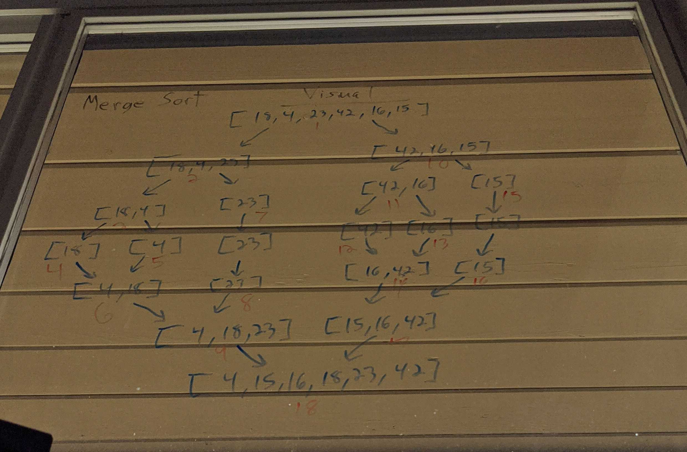

# Merge Sort
Merge Sort is know as a "divide and conquer" algorithm. It was invented by John von Neumann in 1945. It is one of the more efficient sorting algorithms used today, second only to Quick Sort. It utilizes a stack data structure (FILO) in which it recursively calls itself throughout the process.

How Merge Sort works, is that when given an array, it will split the array in half into two arrays. We will call them left & right. The functiion will then call itself twice. One time on the left array and the other on the right array. This will continue to happen until the array is divided into multiple arrays, each consisting of only a single element.

Next it will call a helper function (we will call this one merge) that will sort and merge the two halves together. This function will take in the left array, right array, and original input array. This sorts by first assuming that the the left and right arrays are already sorted. This works because when the merge function is first called, it will be on left and right arrays that only contain one element each. The merge function will look at both of the first elements of the array, and set index 0 of the output array as the lowest of those two values. Whichever side (ie left[1]) is lower it will then check the next element from that side is less than the previously checked element from the other side (ie right[0]).

The merge function will continue this process till it reaches the end of one of the arrays(ie left). At which point it will append the remaining elements from the other arr (ie right) until both arrays are combined to be one. This sort and merge process will continue on until the call stack is completed, returning the a sorted array of the same length as the input array.

This algorithim has a time complexity of O(n log n) and a space complxity of O(n).

